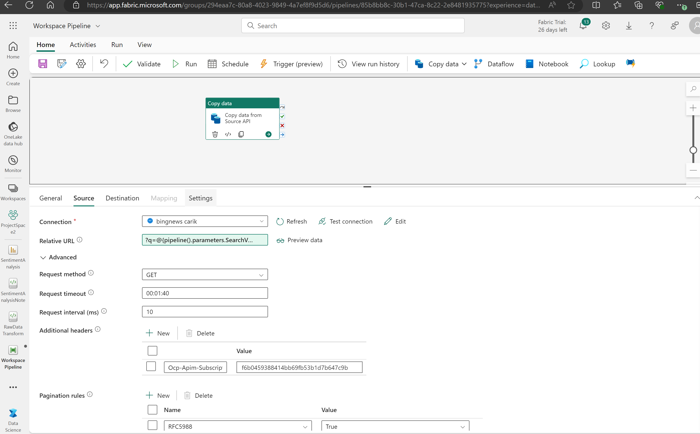

# End-to-End ETL/ML/Power BI Solution in Microsoft Fabric

**_Disclaimer: The datasource is a live public datasets from BING Website to demonstrate the capabilities of ETL process in Microsoft Fabric._**

Welcome to this project! Here, we explore an end-to-end solution for building a text sentiment analysis using public data from the internet, leveraging Microsoft Fabric.

## Skills Demonstrated:
1. Use of Lakehouse and its SQL endpoint for reporting
2. Spark and Notebooks
3. Data Factory Copy activity and Pipeline
4. Machine Learning (NLP)
5. Power BI

---

## Project Scope:

The environment is set up by creating a workspace with the appropriate permissions. For this project, we are using a trial license of Microsoft Fabric, which provides access to F64 capacity, ensuring sufficient computing resources for the workload. The workspace is named ProjectSpace2

This project aims to analyze data from Bing by connecting to live data through an API source. We set up a connection to the Bing REST API using the copy activity feature of Microsoft Fabric, which provides a fast way of loading data with the highest throughput as it requires no transformation.

After loading the data into our data store (lakehouse) using Azure Data Factory (ADF), the collected data, stored in JSON format, is cleaned, transformed, and saved as a dataframe table, then converted to a delta table format in the same lakehouse using a notebook environment.

Once the data is cleaned, it is imported into another notebook for machine learning sentiment analysis. Here, the data is trained using the ML model included in Synapse. The trained data provides the sentiment of the news (positive or negative), and a report is developed.

All processes are connected serially in a pipeline to run concurrently and are scheduled for a daily data refresh with only incremental load for Slowly Changing Dimension Type 2.

## Step 1: Setting up the Environment in Fabric

Create a new workspace named "ProjectSpace2," which will initially be empty and will be populated with other artifacts as they are created. A new datastore is setup and a lakehouse is setup and named as "LH Bronze". The choice of lakehouse is because it supports notebooks and all types of files as we will be working with JSON files.

## Step 2: Use the Copy Activity in the Pipeline to Fetch Data from Bing API
- From the workspace, a new data pipleine is created by selecting from the 'New' button and a new canvas is displayed
- Drag the copy activity feature into the canvas and configure the source and destination of the Bing API.
- Source data is fetched by setting a relative URL and inputting the API header and keys. The keys are private and can be accessed by setting up an Azure resource in the DevOps marketplace.
- The destination is configured to the lakehouse that has been set up.
- The resulting data from the API, in JSON format, is saved under the specified directory in the lakehouse folder section.

                    Image of the copy activity in the canvas of ADF:

## Step 3: Data Transformation and Cleaning in Notebook

- The raw JSON data is cleaned, transformed, and explored, then saved as a dataframe in Spark and subsequently as a table in the same lakehouse, named 'cleaneddata.'
- Data is saved using Spark SQL with an incremental load, typical of Slowly Changing Dimension Type 2, updating rows with changing URLs while preserving the original rows.
  
                    Image of the raw notebook used for cleaning and transformation:

## Step 4: Training the Dataset for Sentiment Analysis Using Machine Learning

- The task is to use Natural Language Processing (NLP) to train a model to recognize text and classify the sentiment as negative, neutral, or positive.
- In this context, the model determines the tone of news articles. This NLP model can also be used for analyzing customer feedback in surveys.
- After training, a new field with the sentiment result is generated in a new table named 'analysedData.'

## Step 5: Build Report in Power BI

- Once the text analysis is complete, build a semantic table using the 'analysedData' table available in the lakehouse.
- Create DAX measures in the model view and develop the report in Power BI Service.

## Step 6: Connecting the Pipeline

- Configure the pipelines to run sequentially, where one data source and action feeds into another.
- The pipeline can be scheduled to run daily, weekly, or as needed to fetch the latest news.
- It's essential for ETL Engineers to connect to a Microsoft Account for regular updates on the status of these activities (success, failure, completion).

                    Image of the workspace and all the artifacts created and also the connected activities with a scheduled run:

  
  
  

## Visuals

                    Image of the Power BI report generated

---

## License

## Acknowledgements

Special thanks to the contributors and the open-source community for providing tools and frameworks that enable the development of such projects.
